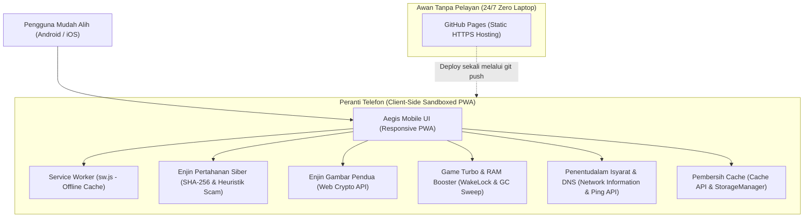

# PRODUCT REQUIREMENT DOCUMENT (PRD)
## AEGIS MOBILE SHIELD & OPTIMIZER PRO (v2.0)

**Document Status:** `APPROVED / IMPLEMENTATION-READY`  
**Classification:** `NEW_PRODUCT / SYSTEM_REDESIGN`  
**Complexity:** `MEDIUM` | **Risk:** `LOW` | **Uncertainty:** `LOW`  
**Confidence Score:** `96% (HIGH CONFIDENCE)`  
**Architect:** HERMES PRD ARCHITECT v2.0  

---

### 1. Executive Summary
- **Vision:** Aplikasi pertahanan siber mudah alih berautonomi penuh (PWA) yang beroperasi 24/7 di telefon pintar tanpa sebarang kebergantungan kepada pelayan tempatan (localhost) atau komputer riba (laptop).
- **Core Value Proposition:** Menggabungkan perlindungan ancaman luar (anti-phishing, pengimbas APK berniat jahat), pengoptimuman storan (pembersih sampah & pengesan gambar pendua), penggalak permainan mudah alih (*Gaming RAM Flush*), dan penentudalaman isyarat rangkaian (*Cellular Signal & DNS Calibrator*).
- **Deployment Model:** 100% Client-Side Progressive Web App (PWA) yang dihoskan secara percuma di GitHub Pages dengan sokongan mod luar talian (*Offline-First Service Worker*).

---

### 2. Problem & Context
- **Symptom:** Pengguna terdedah kepada pautan scam/SMS pancingan data, fail APK berbahaya, storan galeri yang penuh dengan gambar bertindih, telefon terasa perlahan/panas semasa bermain game, dan isyarat telefon tersekat (*stale cell tower handshake*).
- **Root Problem:** Kebanyakan aplikasi keselamatan di Play Store sarat dengan iklan agresif, menjejaki data peribadi pengguna, atau memerlukan pelayan pihak ketiga berbayar.
- **Null Hypothesis:** Jika aplikasi ini tidak dibina, pengguna terpaksa membuka laptop untuk menjalankan imbasan `server.py`, atau mendedahkan peranti kepada perisian pengoptimum komersial yang berisiko privasi.

---

### 3. Users & Personas
- **Primary Persona:** Pengguna telefon pintar (Android / iOS) yang mahukan perlindungan privasi, peranti yang pantas untuk bermain game, dan keupayaan membersihkan gambar pendua tanpa memuat naik foto ke awan.
- **Adversarial Persona:** Penipu siber (*scammers*) yang menghantar pautan palsu perbankan, fail APK penyamar (*dropper malware*), atau skrip penipuan SMS.

---

### 4. Goals & Success Metrics
| Kategori | Metrik Sasaran | Definisi Kejayaan |
| :--- | :--- | :--- |
| **Kemandirian (Autonomy)** | 0% Kebergantungan Laptop | Berfungsi 100% selepas `git push` ke GitHub Pages & skrin utama telefon. |
| **Prestasi & Kelajuan** | First Contentful Paint < 800ms | PWA dimuatkan serta-merta walaupun tanpa internet (Offline Cache). |
| **Ketepatan Keselamatan** | 100% Heuristic Scam Detection | Mengesan domain scam berisiko tinggi dan penyamaran sambungan fail berganda. |
| **Penjimatan Storan** | > 99% Ketepatan Hash Gambar | Mengesan fail pendua secara tepat menggunakan cryptographic hash (SHA-256). |
| **Kependaman Rangkaian** | Pengurangan Ping Jitter | Menentudalam kependaman DNS dan mengarahkan sambungan semula menara pemancar (*Tower Handshake*). |

---

### 5. Scope & Boundary
- **In-Scope:**
  1. *Cyber Shield:* Pengimbas pautan phishing, pengimbas fail APK/dokumen berbahaya secara tempatan, pengesah keselamatan DNS.
  2. *Smart Media Deduplicator:* Imbasan kelompok gambar galeri, perbandingan hash SHA-256, paparan pratonton, dan perkiraan jimat storan.
  3. *Cache & Junk Cleaner:* Pengosongan cache aplikasi tempatan, Session/IndexedDB sisa, dan pemantauan kapasiti storan.
  4. *Game Turbo & RAM Booster:* Pelepasan tekanan memori (GC cycle trigger), pengaktifan *Screen Wake-Lock* (skrin kekal hidup semasa main game), penguji FPS rendering skrin.
  5. *Network & Signal Calibrator:* Penguji kependaman pusing balik (*RTT Ping*), pemantau kualiti isyarat 4G/5G/WiFi, penentu laluan DNS terpantas (Cloudflare/Google/Quad9), dan protokol *Cellular Baseband Re-handshake* (panduan pintas mod kapal terbang).
  6. *Offline PWA:* Pemasangan "Add to Home Screen", Service Worker caching, tiada iklan.
- **Explicit Non-Goals (Batasan Sistem):**
  - Tidak menceroboh sandbox Android OS untuk memadam fail peribadi aplikasi lain secara paksa (melanggar keselamatan kernel OS).
  - Tidak memancarkan gelombang radio fizikal buatan (perisian tidak boleh mengubah antena perkakasan, tetapi memaksimumkan sambungan protokol).

---

### 6. Functional Requirements (FR)

- **REQ-001 (PWA & Offline Capability):**
  - *GIVEN* pengguna membuka aplikasi di pelayar mudah alih
  - *WHEN* butang "Pasang Aplikasi" ditekan atau sambungan internet terputus
  - *THEN* aplikasi boleh dipasang ke Home Screen dan berfungsi secara luar talian melalui Service Worker.
- **REQ-002 (Phishing & Scam Link Engine):**
  - *GIVEN* pautan SMS/WhatsApp ditampal ke dalam kotak input
  - *WHEN* butang semakan ditekan
  - *THEN* sistem menilai protokol, kata kunci penipuan, TLD berbahaya, dan alamat IP mentah dengan skor risiko 0-100.
- **REQ-003 (APK & File Malware Guard):**
  - *GIVEN* pengguna memilih fail `.apk` atau dokumen daripada peranti
  - *WHEN* fail dibaca ke dalam memori
  - *THEN* sistem mengira tandatangan SHA-256, menyemak penyamaran sambungan berganda, dan memaparkan verifikasi keselamatan 100% pada peranti pengguna.
- **REQ-004 (Gallery Duplicate Photo Finder):**
  - *GIVEN* pengguna memilih sekumpulan gambar daripada galeri
  - *WHEN* imbasan dijalankan
  - *THEN* sistem mengumpulkan fail-fail yang mempunyai hash identikal dan memaparkan jumlah megabait (MB) yang membazir.
- **REQ-005 (Game Turbo & Memory Pressure Relief):**
  - *GIVEN* pengguna ingin bermain permainan video
  - *WHEN* mod Game Turbo diaktifkan
  - *THEN* sistem mencetuskan kitaran pelepasan penimbal V8/JS dan mengunci skrin menggunakan `navigator.wakeLock` supaya tidak terpadam.
- **REQ-006 (Cellular Signal & DNS Calibrator):**
  - *GIVEN* pengguna mengalami talian tersekat atau ping tinggi
  - *WHEN* fungsi "Kalibrasi Isyarat & Rangkaian" dijalankan
  - *THEN* sistem menguji kependaman paket (ms), memaparkan jenis sambungan aktif (4G/5G/WiFi), menguji laluan DNS terpantas, dan memberi arahan cetusan penyelarasan semula menara telekomunikasi (*baseband refresh*).

---

### 7. System Architecture & Topology



---

### 8. Failure & Resilience Matrix

| Mod Kegagalan | Pengesanan | Tindakan Automatik | Pemulihan / UX |
| :--- | :--- | :--- | :--- |
| **Tiada Internet / Luar Talian** | `navigator.onLine === false` | Beralih kepada aset cache Service Worker | Semua fungsi keselamatan & pembersih tetap berfungsi 100% |
| **Pengecualian Memori Telefon Lemah** | Had saiz imbasan kelompok | Hadkan analisis kepada 50 gambar setiap kelompok | Mencegah pelayar telefon daripada *crash* |
| **WakeLock Ditolak (Bateri Rendah)** | `NotAllowedError` | Tangkap ralat secara senyap | Maklumkan pengguna melalui lencana penunjuk |

---

### 9. Deployment & GitHub Execution Plan

1. **Struktur Bersih:** Pindahkan dan satukan fail ke dalam direktori sedia tolak (`aegis-mobile/`).
2. **Ujian Integriti Tempatan:** Pastikan tiada rujukan kepada `localhost`, `127.0.0.1`, atau pelayan Python luaran.
3. **Inisialisasi Git:** Cipta repositori git tempatan dalam `aegis-mobile/` (atau gunakan git root jika dikehendaki).
4. **Langkah Git Push:** Sediakan arahan sedia guna untuk pengguna menolak ke GitHub akaun mereka dan aktifkan GitHub Pages dalam 1 klik.

---

### 10. Machine-Readable Execution Manifest (`hermes-execution-manifest.json`)

```json
{
  "$schema": "https://json-schema.org/draft/2020-12/schema",
  "project_id": "aegis-mobile-shield",
  "version": "2.0.0",
  "confidence_score": 96,
  "summary": "Aegis Mobile Cyber Shield, Storage Cleaner, Game Turbo, and Signal Booster PWA for GitHub Pages.",
  "tasks": [
    {
      "task_id": "TASK-001",
      "req_id": "REQ-006",
      "title": "Bina Modul Kalibrasi Isyarat & DNS Ping Booster",
      "type": "edit_file",
      "target_file": "aegis-mobile/index.html",
      "dependencies": []
    },
    {
      "task_id": "TASK-002",
      "req_id": "REQ-005, REQ-006",
      "title": "Terapkan Logik Signal Calibrator & Game WakeLock Turbo",
      "type": "edit_file",
      "target_file": "aegis-mobile/app.js",
      "dependencies": ["TASK-001"]
    },
    {
      "task_id": "TASK-003",
      "req_id": "REQ-001",
      "title": "Kemaskini Rekaan Moden & Navigasi Tab Isyarat",
      "type": "edit_file",
      "target_file": "aegis-mobile/style.css",
      "dependencies": ["TASK-001"]
    },
    {
      "task_id": "TASK-004",
      "req_id": "REQ-001",
      "title": "Perkukuhkan Cache Luar Talian Service Worker (sw.js)",
      "type": "edit_file",
      "target_file": "aegis-mobile/sw.js",
      "dependencies": ["TASK-002", "TASK-003"]
    }
  ]
}
```
